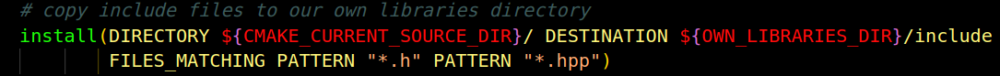

# **CURRENT CMAKE POLICY**
---
## General information

Our current Cmake  policy assumes that each module has its independent CMake tree - main CMakeLists.txt file lands directly in the module's top directory (for example: one in `backend` module, one in `tests` etc.).

Each module will build its target a little bit differently, and create different binaries, serving different purposes.
Hopefully this allows us for better separation and other benefits of such approach.
This might resonate in slightly different approaches used in CMake organization of the specific modules.
Therefore each module will be considered separately, although some parts of CMakeLists.txt might be very similar (if not identical).

---
# `backend` module

The `backend` module is designated to be core module for other modules to use its binaries.
It is supposed to be completely independent from other modules.

In fact, backend module won't produce typical executable binary (it has no `main.cpp` file).

Instead it will produce multiple libraries, each corresponding directly to its submodule.
Those libraries will land in separate folder (currently called `own_libraries`).

For example:
`libclinic-lib.a` - relates to `modules/clinic` subfolder.
`libcommon-lib.a` - relates to `modules/common` subfolder.
`libpatients-lib.a` - relates to `modules/patients` subfolder.
`libserializer-lib.a` - relates to `modules/serializer` subfolder.
`libvisits-lib.a`- relates to `modules/visits` subfolder.
`libwarehouse-lib.a` - relates to `modules/warehouse` subfolder.

Naturally the names of libraries and folders might suffer some slight changes but the main idea stays the same.

Those libraries (or maybe one library - if we decide so) are to be linked in other modules as per need basis.

### Overview of main `backend` CMakeLists.txt

The main CMakeLists.txt is supposed to have simple structure (hopefully it will stay this way).

As usual we set minimum version of required Cmake version, project name and C++ standard:

Next we set cmake variable corresponding to folder of installed external libraries, to keep them separated:

and variable corresponding to own libraries installation folder

Both variables require update of exact path after refactor phase is completed.
The reference point is `${PROJECT_SOURCE_DIR}`, which is the folder where CMakeLists.txt for backend module resides.

Next we include a helper cmake file:

The purpose of this file is to separate potentially ugly installation rules for external libraries, which we want to keep fixed and common for all devs to use as common environment as possible (in some cases it might even be necessary)

For starter it contains one rule for `protobuf` library:

Not all in this file is obvious for me. I trusted GH Copilot with that and only adjusted to work.
I consider it to be experimental for the time being.

Coming back to main CMakeLists.txt, we find try to find the version matching the one we requested in helper `installation_rules.cmake` file:

Hopefully, after running cmake all above will install and find the specific, fixed version placed in external_libraries/protobuf folder.
It should be found instead of any other system-installed version of protobuf (at least for development, maybe will not work for running binaries).

On my machine it produces something like this (snippet from cmake print):

Finally we just add modules subfolders:

So in fact, the specific library targets will be specified in each subfolder CMakeLists.txt file.

### One CMakeLists.txt for each `backend` submodule concept

As mentioned before, each backend sub-module will have just one CMakeLists.txt file.
This might make it a little bit longer but allows us to maintain just one file for each sub-module.

The example structure of sub-module CMakeLists.txt will be explained on clinic submodule.
Other submodules look very similar.

1. We set library source files to be linked in library executable:

   

    Actually we just set a variable `CLINIC_SOURCES` here for later usage in target definition.
    This part will be eddited most often - each time new cpp file lands anywhere in this submodule's folder (and in any of its descendants), we will add it here.
    Note that relative paths given here reflect exactly the specific structure of a specific submodule (`modules/clinc` in this example).
    This should be easy to follow.
    **RECOMMENDATION 1: please stick to rule for one cpp file per line here. This will help in file editing and conflict resolving**
    **RECOMMENDATION 2: please keep alphabetic order. This will help to find correct place for addition when list will grow.**

2. Next we create the library target for our submodule:

   

   As for now I decided to choose `STATIC` library type. Alternatively we might consider `SHARED`  or `OBJECT` library type - which have their own probems and use cases.

3. We set compile options for our library. In our case this are all compiler warning / error policies:

   

4. Next we define libraries linked to our library:

   

   This part needs to be considered as per need basis for submodule.
   NOTE: I am not sure if we want `PUBLIC` here. We might experiment with PRIVATE and see if it works.
   **RECOMMENDATION 1: please stick to rule for one library per line here. This will help in file editing and conflict resolving**
   **RECOMMENDATION 2: unless order of libraries link matters, please try to add libs in alphabetic order**

5. As next step we include current module subfolder as start path for including:

   

   This will allow us to keep consistent `#include` policy:
   - if some header is placed directly in submodule - we just give it's name, say `#include "Clinic.hpp"`
   - if the header is deeper in folder hierarchy and we want to include it in another submodule lib, we treat the submodule main dir as top level. In fact, all modules behave like their siblings folders were their own.
   For example: when coding in `patients` submodule we want to include `Room.cpp` (from `clinic`) we treat `clinic` folder as top level and just write: `#include "room/Room.hpp"`

   Regardless of the above, whenever we include something, which is in same folder as our file we just write `#include "someFile.hpp"`

6. In one of final steps we need to install our library in own_libraries folder. This is done through:

   

   This is required for development of other modules like `tests` or `frontend` in independent cmake trees.

7. But besides the binaries of libs we also need to install/copy include files of current submodule in own_libraries folder.

   

   This is not needed for other `backend` submodules (as we have common tree and link libraries with specific directives).
   But without this we could not use includes conveniently in other modules, like `tests` or `frontend` for example.
---

# `tests` module

The module has it's own, seperate main CMakeLists.txt file, in `tests` folder.

## Main CMakeLists.txt for tests module

1. We set minimum required version of cmake, test-project name and set C++ standard in same way as in `backend` module.

2. We set variable specifying the folder, from which we use libraries built by `backend` target:

   

   NOTE: the path is to be adjusted after refactor phase.

3. We set variable specifying where all tests executable binaries will land:

   

   This allows us to run specific test binary in isolation if we want, directly in `bin` folder.
   In general, we took "separate binary for each test" approach.
   If we want to run all tests - we can run them via `ctest` approach (described in separate document).

4. We install specific, fixed version of Google Test to be used consistently by all developers:

   

   If we follow into thee above helper cmake installation file we can see:

   

   In this approach Google Test will be downloaded and built together with tests.
   The version acquired this way will take precedence over any system installed version.

5. We include Google Test and enable ctest / Google Test support:

   

6. Next, we define a set of variables for helping with specific target-linking definitions

   

7. To this we add a variable specifying folder of backend includes installation:

   

8. We don't define any binary targets in main CMakeLists.txt file.
   We forward it to inner tests module subfolders:

   

## subfolders of `test` module

Currently there are only two test submodules (with at least another one - `frontend` to come soon):
- integration_tests
- unit_tests.

They have their own CMakeLists.txt files, which are very simple to keep things clean.
So they only forward specific target definition to further cmake files residing in specific folders:
- for integration_tests (it is almost empty currently)

- for unit_tests:

There are only a few of them now, but it will grow.
**RECOMMENDATION: for every logically separate unit test define another subfolder and in it - specific CMakeLists.txt file.**

Each final subfolder (for example `tests/unit_test/common/validators`) will have it's own CMakeLists.txt file.
This end-point cmake file will define the specific executable binary target (or multiple binary targets) to be built.

## example of specific test CMakeLists.txt file

In general, we try to keep balance between separation and trying not to produce hundreds of cmake files.

As example `tests/unit_tests/common/enumerations/CMakeLists.txt` will be analyzed.

NOTE: this cmake file is a bit specific, as it defines many test targets, each building one binary for single unit-test.
This is reasonable as all "enumeration" tests can be defined in one place, but binaries will be separate for each tested class/enum.
In different cases it would be perfectly OK, if we defined just one target (binary) in CMakeLists.txt.

1.  We define a couple of test-binaries (targets), each with it's source file.

    

2.  We set a helper variable and apply same compilation options for each binary-target defined in the previous step:

    

    If we had only one target in the CMakeLists.txt, most likely it would be pointless to define variable, and we might paste compilation options directly.

3.  We set include directories for defined targets:

    

    This allows us to use include directories in the same way as in the `backend` source files.

4.  We set linking targets for each of previously defined targets:

    

5.  Finally we define tests with names we want to be displayed when running tests with ctest:

    
